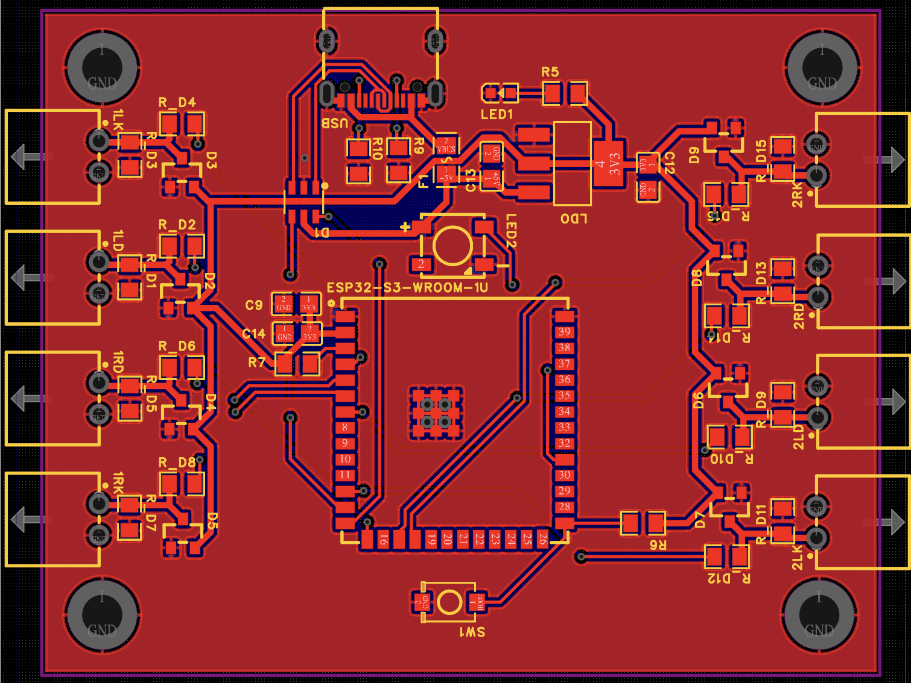

> **Legacy implementation archived:** the old Arduino/ATmega32U4 and earlier ESP32 implementation from `master` has reached end of life and is archived on the `archive-arduino-legacy` branch. This branch documents the refactored ESP-IDF implementation.


# Taiko Drum Controller - ESP32-S3

Open-source firmware for building a USB taiko drum controller for PC play. The refactored implementation is focused on ESP32-S3, TinyUSB HID gamepad output, and continuous ADC sampling through DMA.

This version is intended for Taiko Force Lv. 6 style drums and other two-player, eight-sensor taiko builds. The older Arduino keyboard/gamepad implementations are no longer maintained in this branch.

**This project is for personal and non-commercial use only.**

## Current Status

- Supports Taiko Force Lv. 6 drum wiring through ESP32-S3 ADC continuous mode with DMA.
- Reports as a USB HID gamepad named `Taiko Controller` with vendor/product ID `0x4869:0x4869`.
- Samples eight ADC channels, covering two players with four zones each.
- Sends analog hit strength through gamepad axes instead of keyboard events.
- Uses ESP-IDF and TinyUSB. Arduino SDK support has been removed.
- PCB Gerber files and BOM are available in [`PCB/`](./PCB/).
- 3D printed housing is under construction and will be added when ready.

## Hardware Support

The supported target is **ESP32-S3**.

Other ESP32 variants may work if they support the same ADC continuous mode, DMA behavior, USB device mode, and pin availability, but they are not tested. Arduino boards, ATmega32U4 boards, and non-USB ESP32 development boards are not supported by this refactored firmware.

## Firmware Overview

The firmware in [`main/taiko_controller.c`](./main/taiko_controller.c) does four main things:

1. Configures TinyUSB as a HID gamepad.
2. Configures ADC continuous sampling for eight drum sensor inputs.
3. Uses DMA frames to accumulate ADC samples at a stable rate.
4. Converts recent per-zone signal power into signed gamepad axis values.

The current sampling model is:

- `PLAYERS`: `2`
- `CHANNELS_PER_PLAYER`: `4`
- `TOTAL_CHANNELS`: `8`
- `PER_CHANNEL_SAMPLE_RATE_HZ`: `10000`
- `USB_REPORT_INTERVAL_US`: `2000`
- `POWER_RING_SIZE`: `3`

Each player has four zones:

1. Left don
2. Left kat
3. Right don
4. Right kat

Only the strongest zone for each player is emitted in each HID report. Don zones are sent as positive axis values and kat zones are sent as negative axis values.

## Pin Map

The default ADC pin map uses ADC1 GPIOs on ESP32-S3 and avoids the native USB pins.

| Player | Zone | GPIO |
| --- | --- | --- |
| P1 | Left don | 3 |
| P1 | Left kat | 4 |
| P1 | Right don | 5 |
| P1 | Right kat | 6 |
| P2 | Left don | 7 |
| P2 | Left kat | 8 |
| P2 | Right don | 9 |
| P2 | Right kat | 10 |

Debug outputs:

| GPIO | Meaning |
| --- | --- |
| 1 | High when ADC read fails or times out |
| 2 | High when the USB HID host is not ready |

If you change pins, use ADC-capable pins for the selected ESP32-S3 board and keep GPIO 19/20 free for native USB unless your board routes USB differently.

## Requirements

- ESP32-S3 development board with native USB device support.
- ESP-IDF 5.x environment.
- Four piezo sensors per drum, eight total for two-player support.
- Signal conditioning appropriate for piezo sensors and the ESP32-S3 ADC input range.
- USB cable connected to the ESP32-S3 native USB port.

Hardware files:

- Project PCB, Gerber archive, and BOM are available in [`PCB/`](./PCB/).
- 3D printed enclosure/housing is still in progress.
- Final assembly guide for Taiko Force Lv. 6 style hardware is still in progress.

## PCB

The current PCB package is available under [`PCB/`](./PCB/):

- [`PCB/PCB.png`](./PCB/PCB.png): PCB preview image.
- [`PCB/Taiko_DMA_PCB.zip`](./PCB/Taiko_DMA_PCB.zip): Gerber production archive.
- [`PCB/Taiko_DMA_BOM.xlsx`](./PCB/Taiko_DMA_BOM.xlsx): bill of materials spreadsheet.



The board is designed around the ESP32-S3-WROOM-1U module and the DMA-based firmware in this repository. Review the BOM and board files before ordering or assembly, especially while the housing and final assembly guide are still in progress.

## Build and Flash

Install and activate ESP-IDF, then build for ESP32-S3:

```sh
idf.py set-target esp32s3
idf.py build
idf.py flash monitor
```

The project uses ESP-IDF component manager dependencies from [`main/idf_component.yml`](./main/idf_component.yml), including `espressif/esp_tinyusb`.

The default SDK configuration in [`sdkconfig.defaults`](./sdkconfig.defaults) sets:

```ini
CONFIG_TINYUSB_HID_COUNT=1
```

## Gamepad Output

The USB device descriptor is configured as:

- Manufacturer: `Taiko Community`
- Product: `Taiko Controller`
- VID: `0x4869`
- PID: `0x4869`

Current axis mapping:

| Player | Zone | HID output |
| --- | --- | --- |
| P1 | Left don | `+X` |
| P1 | Left kat | `-X` |
| P1 | Right don | `+Y` |
| P1 | Right kat | `-Y` |
| P2 | Left don | `+Rx` |
| P2 | Left kat | `-Rx` |
| P2 | Right don | `+Ry` |
| P2 | Right kat | `-Ry` |

The firmware also pulses the gamepad Y button once per second so host-side tools can see that the controller is alive even when the drum is idle.

## Tuning

The main tuning constants are currently in [`main/taiko_controller.c`](./main/taiko_controller.c):

- `s_channel_sensitivity`: per-zone multipliers used to normalize piezo response.
- `POWER_CLAMP`: signal power level that maps to the maximum gamepad axis value.
- `POWER_RING_SIZE`: number of recent report windows used for peak hold.
- `PER_CHANNEL_SAMPLE_RATE_HZ`: ADC sampling rate per channel.
- `USB_REPORT_INTERVAL_US`: HID report interval.

The default sensitivity array is:

```c
static float s_channel_sensitivity[TOTAL_CHANNELS] = {
    1.0f, 15.0f, 1.0f, 15.0f,
    1.0f, 15.0f, 1.0f, 15.0f,
};
```

Kat sensors are currently boosted relative to don sensors. You should expect to tune these values for your drum, sensor placement, shell material, and circuit.

## Signal Conditioning Notes

Piezo sensors can produce voltage outside the safe ADC input range. Protect the ESP32-S3 ADC inputs before connecting a drum directly.

The legacy implementation documented bridge rectifiers because raw piezo output can swing negative and lose useful signal when clipped by the ADC. That concern still applies at the hardware level, but the new firmware is centered on high-rate ADC sampling rather than the old Arduino threshold detector.

Even with the PCB package available, treat the wiring and analog front end as experimental until the housing and final assembly guide are finished.

## Repository Layout

```text
.
|-- CMakeLists.txt
|-- sdkconfig.defaults
|-- dependencies.lock
|-- main/
|   |-- CMakeLists.txt
|   |-- idf_component.yml
|   `-- taiko_controller.c
|-- extra/
|   `-- bnusio.dll
|-- images/
|   `-- banner-taiko.png
|-- PCB/
|   |-- PCB.png
|   |-- Taiko_DMA_BOM.xlsx
|   `-- Taiko_DMA_PCB.zip
`-- pytest_adc_continuous.py
```

## Game Integration

The `extra/` directory currently contains a modified `bnusio.dll` carried over from the analog-input workflow. Depending on the game build, you may still need to configure SDL/gamepad mappings so the `Taiko Controller` axes are interpreted as drum input.

The old README included game-specific configuration notes for the previous analog firmware. Those notes are preserved on the `archive-arduino-legacy` branch, but they may not exactly match this refactored HID report layout.

## Testing

[`pytest_adc_continuous.py`](./pytest_adc_continuous.py) is a placeholder for hardware integration testing and is skipped by default because it requires real ESP32-S3 ADC/HID hardware.

For practical testing:

1. Build and flash the firmware.
2. Confirm the USB device appears as `Taiko Controller`.
3. Check idle gamepad activity from the pulsed Y button.
4. Strike each zone and verify the expected axis direction and magnitude.
5. Tune `s_channel_sensitivity` and `POWER_CLAMP` until all zones respond consistently.

## Roadmap

- Publish 3D printed housing files.
- Add a finalized Taiko Force Lv. 6 wiring and assembly guide.
- Add hardware-backed validation for ADC sampling and HID output.
