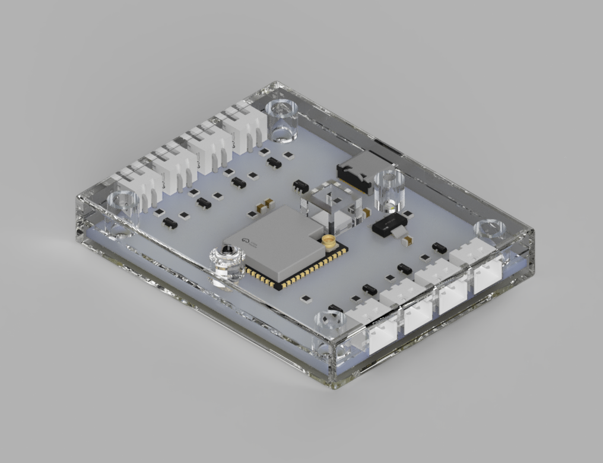
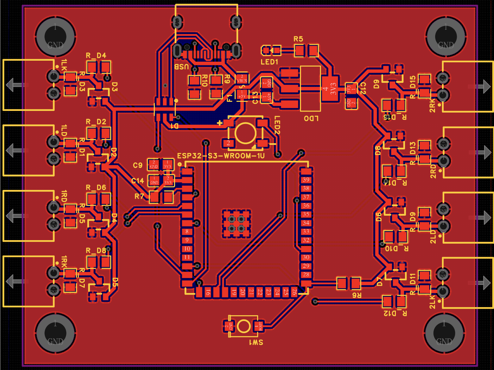
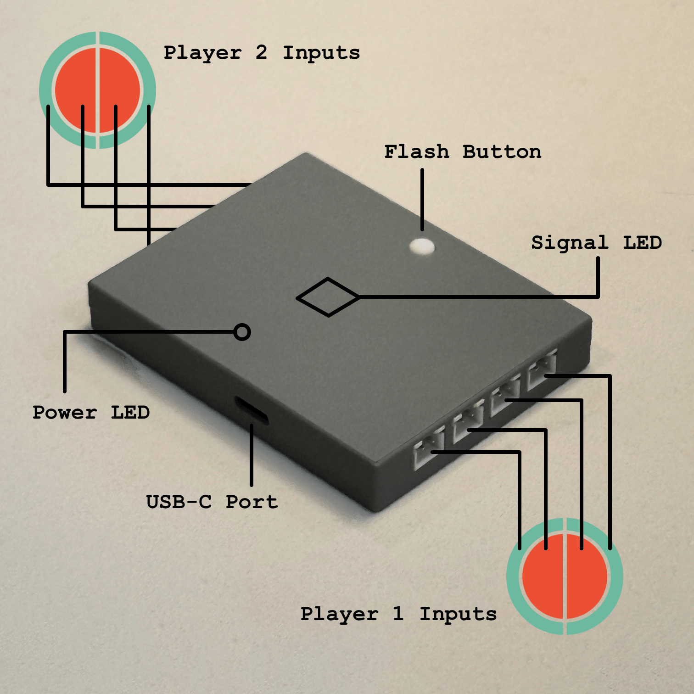
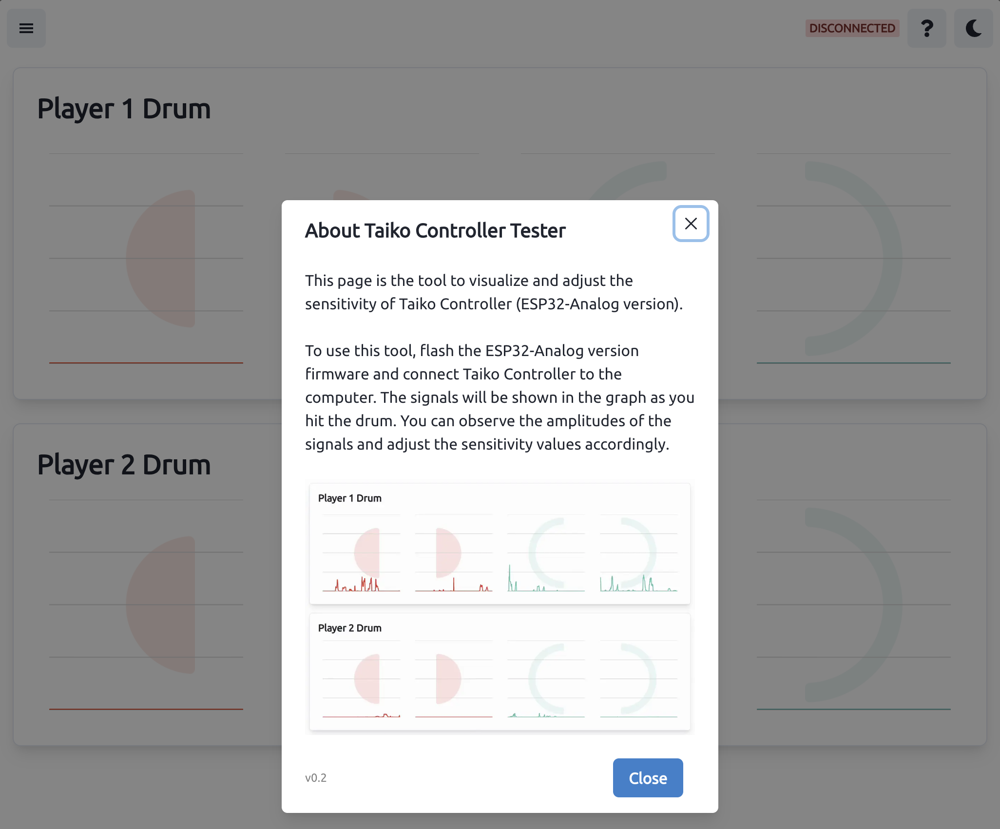

> **Legacy implementation archived:** the old Arduino/ATmega32U4 and earlier ESP32 implementation from `master` has reached end of life and is archived on the [`archive-arduino-legacy` branch](https://github.com/ShikyC/Taiko-Drum-Controller-Arduino/tree/archive-arduino-legacy). This branch documents the refactored ESP-IDF implementation.



# Taiko Drum Controller - ESP32-S3

Open-source firmware and hardware for building an ESP32-S3 USB taiko drum
controller. A boot-time DIP setting selects the existing two-player analog
Arcade output, PC XInput, Nintendo Switch, or PlayStation 4 USB reports. The
three digital modes expose one player and publish drum strikes as buttons.

The firmware has been thoroughly tested with Taiko Force Lv. 5 and Lv. 6 drums. In theory, it works with other custom-made drums, but I haven't done any verification yet.

## Current Status

- [x] Supports Taiko Force Lv. 5/6 drum wiring through ESP32-S3 ADC continuous mode with DMA.
- [x] Processes two players with profiles calibrated against various 1P and 2P captures.
- [x] Sends two-player analog hit strength through gamepad axes in Arcade mode.
- [x] PCB Gerber files and BOM are available in [`PCB/`](./PCB/).
- [x] [3D printed shell](./PCB/3D_Print_Shell.3mf) is ready.
- [x] Shows each accepted sensor channel with its own addressable RGB LED.
- [x] Reads the V2 D-pad, face, shoulder, trigger, menu, and Home buttons with
  5 ms debounce and translates them for each selected controller protocol.
- [x] Provides Arcade HID, PC XInput, Nintendo Switch, and PS4-shaped USB
  descriptors and input reports.
- [x] Supports asynchronous, credential-backed PS4 authentication when the
  firmware is provisioned at build time.
- [ ] Physical USB enumeration and gameplay validation of the three new modes
  still require tests on the production board and target hosts/consoles. This
  includes a sustained authenticated PS4 session with provisioned credentials.

## Hardware Support

The supported target is **ESP32-S3**.

Other ESP32 variants may work if they support the same ADC continuous mode, DMA behavior, USB device mode, and pin availability, but they are not tested. Arduino boards, ATmega32U4 boards, and non-USB ESP32 development boards are not supported by this firmware.

## Firmware Overview

The firmware does these main things:

1. Samples all four DIP switches once at boot, then selects the detector
   profiles and USB protocol for that entire connection.
2. Configures TinyUSB as Arcade HID, XInput, Nintendo Switch HID, or PS4 HID
   through [`main/taiko_usb.c`](./main/taiko_usb.c).
3. When PS4 credentials are provisioned, validates the embedded RSA key before
   ADC startup and handles console challenges on an asynchronous worker through
   [`main/taiko_ps4_auth.c`](./main/taiko_ps4_auth.c).
4. Configures ADC continuous sampling for all eight sensor inputs in Arcade
   mode or only P1's four inputs in the three single-player modes.
5. Reassembles complete scans independent of DMA frame boundaries.
6. Converts raw ADC readings through an eFuse-calibrated millivolt lookup table.
7. Runs baseline removal, a 0.96 ms RMS window, winner selection, and hit/rearm
   state through the platform-independent processor in
   [`main/taiko_hit_processor.c`](./main/taiko_hit_processor.c).
8. Builds mode-specific reports through the pure translators in
   [`main/taiko_reports.c`](./main/taiko_reports.c). Arcade mode keeps analog
   strength; XInput, Switch, and PS4 modes convert P1 hits to buttons.
9. Polls and debounces the digital controls at the USB report cadence and
   notifies a lower-priority, core-isolated RMT worker that drives eight
   independent channel indicators without blocking ADC processing.

The detector receives the same calibrated per-channel sample rate in every
mode:

- `PLAYERS`: `2`
- `CHANNELS_PER_PLAYER`: `4`
- Arcade: 8 active channels, requested aggregate rate `83333` conversions/s,
  actual aggregate rate `83333.333` conversions/s
- XInput/Switch/PS4: 4 active P1 channels, requested aggregate rate `41666`
  conversions/s, actual aggregate rate `41666.667` conversions/s
- actual per-channel rate: `10416.667` samples/s
- `USB_REPORT_INTERVAL_US`: `1000`
- detector integration and capture latency: about `1.73 ms`
- output hold: `12 ms`
- standard-profile per-zone refractory interval: `12 ms`
- long-tail-profile per-zone refractory interval: `19.2 ms`

Each player has four zones:

1. Left don
2. Left ka
3. Right don
4. Right ka

Only the strongest zone for each active player is emitted in each USB report.
In Arcade mode, Don zones are positive axes and Ka zones are negative axes. In
the three digital modes, P2 is not sampled and the P1 result becomes the button
mapping documented below.

## Pin Map

The firmware always uses the ESP32-S3 **GPIO/IO number**, not the physical
module-pin number. The two number spaces are deliberately shown separately
below. Module-pin numbers apply to the ESP32-S3-WROOM-1/1U itself, not a
development-board header. See Espressif's
[official module datasheet](https://www.espressif.com/sites/default/files/documentation/esp32-s3-wroom-1_wroom-1u_datasheet_en.pdf).

The default ADC pin map uses ADC1 GPIOs and avoids the native USB pins:

| Player | Zone | ESP32-S3 GPIO/IO | WROOM module pin |
| --- | --- | ---: | ---: |
| P1 | Left don | 3 | 15 |
| P1 | Left ka | 4 | 4 |
| P1 | Right don | 5 | 5 |
| P1 | Right ka | 6 | 6 |
| P2 | Left don | 7 | 7 |
| P2 | Left ka | 8 | 12 |
| P2 | Right don | 9 | 17 |
| P2 | Right ka | 10 | 18 |
| Shared | Eight-pixel RGB chain data | 38 | 31 |

V2 digital controls are active-low and use the individual external 10 kOhm
pull-ups shown in the schematic:

| Control | ESP32-S3 GPIO/IO | WROOM module pin | Logical output |
| --- | ---: | ---: | --- |
| D-pad up/right/down/left | 11/12/13/14 | 19/20/21/22 | D-pad |
| Face up/right/down/left | 15/16/17/18 | 8/9/10/11 | North/east/south/west |
| L1/R1 | 47/48 | 24/25 | L1/R1 |
| L2/R2 | **1/2** | **39/38** | L2/R2 |
| Select/Start | **43/44** | **37/36** | Select/Start |
| Home/BOOT | 0 | 27 | Home at runtime; download boot when held during power-on |

In particular, **module pin 39 is GPIO1 and is L2**. It is unrelated to
**GPIO39, which is module pin 32 and is DIP1**. Likewise, module pins 38, 37,
and 36 translate to GPIO2, GPIO43, and GPIO44 for R2, Select, and Start.

GPIO43 is reclaimed from UART0 after boot, so the application and bootloader
console outputs are disabled in [`sdkconfig.defaults`](./sdkconfig.defaults).
The immutable ESP32-S3 ROM can still briefly use TXD0 during reset; the board's
normal usage contract is therefore to leave Select released while plugging in.

The four active-low DIP poles are sampled once during startup:

| DIP | ESP32-S3 GPIO/IO | WROOM module pin | ON behavior |
| --- | ---: | ---: | --- |
| 1 | **39** | **32** | P1 firm/long-tail detector profile |
| 2 | 40 | 33 | P2 firm/long-tail detector profile |
| 3 | 41 | 34 | Mode bit 0 |
| 4 | 42 | 35 | Mode bit 1 |

Mode bits are ordered as `DIP4:DIP3`:

| DIP4 | DIP3 | Controller mode | Drum players | Drum output |
| --- | --- | --- | ---: | --- |
| OFF | OFF | Arcade HID | 2 | Analog strength on X/Y/Z/Rz |
| OFF | ON | PC XInput | 1 | Buttons |
| ON | OFF | Nintendo Switch | 1 | Buttons |
| ON | ON | PlayStation 4 | 1 | Buttons; see credential provisioning below |

All four DIP states are latched once before USB and ADC initialization.
Changing any pole while the board is running does nothing; unplug the board,
set the switches, and reconnect it. DIP2 is latched but P2 is disabled in all
three single-player modes.

If you change pins, use ADC-capable pins for the selected ESP32-S3 board and keep GPIO 19/20 free for native USB unless your board routes USB differently.

The addressable RGB chain uses 24-bit `GRB` data per pixel. Its physical order
and fixed hit colors are:

| Pixel | Hit channel | Color |
| --- | --- | --- |
| LED2 | P1 left Ka | Blue |
| LED3 | P1 left Don | Red |
| LED4 | P1 right Don | Red |
| LED5 | P1 right Ka | Blue |
| LED6 | P2 left Ka | Blue |
| LED7 | P2 left Don | Red |
| LED8 | P2 right Don | Red |
| LED9 | P2 right Ka | Blue |

Each accepted hit holds only its own pixel for 120 ms. A Don sets only the red
component and a Ka sets only the blue component, so no purple signal is sent;
simultaneous hits across any P1/P2 channels remain independent. This LED order
does not change the ADC input order.

## Requirements

- ESP32-S3 development board with native USB device support.
- ESP-IDF 5.x environment.
- Four piezo sensors per drum, eight total for two-player support.

The existing [`espressif/esp_tinyusb`](./main/idf_component.yml) dependency is
sufficient for all four transports. XInput uses TinyUSB's custom class-driver
hook and Microsoft OS 2.0 descriptor; Switch and PS4 use HID. Credential-backed
PS4 builds use ESP-IDF's bundled mbedTLS implementation. No additional
controller library needs to be installed manually. ESP-IDF's component manager
resolves the locked components during the normal build.

Hardware files:

- Project PCB, Gerber archive, and BOM are available in [`PCB/`](./PCB/).
- (Optional) 3D printed shell.

## PCB

The current PCB package is available under [`PCB/`](./PCB/):

- [`PCB/PCB.png`](./PCB/PCB.png): PCB preview image.
- [`PCB/Taiko_DMA_PCB.zip`](./PCB/Taiko_DMA_PCB.zip): Gerber production archive.
- [`PCB/Taiko_DMA_BOM.xlsx`](./PCB/Taiko_DMA_BOM.xlsx): BOM spreadsheet.



The board is designed around the ESP32-S3-WROOM-1U module and the DMA-based firmware in this repository. Review the BOM and board files before ordering or assembly, especially while the housing and final assembly guide are still in progress.

## 3D Printing

The [shell's 3MF file](./PCB/3D_Print_Shell.3mf) is ready to be used with any slicer software and 3D printers. Tested with PLA. Note that for the best result, use 0.2mm nozzle. Larger nozzle can cause some thin walls to be broken.

To finish the build, in addition to the PCB BOM, you'll need:

- M3 countersunk screw x 4
- M3 heat inserts x 4

An assembled example is shown below.



## Build and Flash

Install and activate ESP-IDF, then build for ESP32-S3:

```sh
idf.py set-target esp32s3
idf.py build
```

If you see build errors, make sure to set the following [`sdkconfig.defaults`](./sdkconfig.defaults) value:

```ini
CONFIG_TINYUSB_HID_COUNT=1
```

To enter flashing mode on the V2 board, press and hold Home/BOOT, then plug in
the USB cable. The button directly pulls GPIO0 low; no inverter is required.
Then flash the firmware:

```sh
idf.py flash
```

After flashing, release Home/BOOT, set all four DIP switches, then unplug and
reconnect USB. The reported product depends on the selected mode:

| Mode | USB product/driver |
| --- | --- |
| Arcade | `Taiko Controller`, generic HID gamepad |
| PC | `Taiko Controller (XInput)`, Windows XUSB/XInput driver |
| Nintendo Switch | `POKKEN CONTROLLER`, Switch-compatible HID |
| PS4 | `Taiko Controller (PS4)`, PS4-shaped HID reports |

### PS4 Authentication

An ordinary `idf.py build` remains credential-free. It produces PS4-shaped HID
reports for host development, but a native PS4 session will still reach the
console's authentication timeout.

Credential-backed builds accept this private directory layout. The short file
names already used by this checkout and the GP2040-CE-style aliases are both
supported:

```text
ps4_auth/
├── key.pem          # or private.pem; unencrypted 2048-bit RSA private key
├── serial.txt       # exactly 16 hexadecimal characters
└── sig.bin          # or signature.bin; exactly 256 bytes
```

Only use credentials you are authorized to use. This project does not include
or distribute PlayStation credentials. Build and flash a dedicated image with:

```sh
idf.py -B build-ps4-auth -DTAIKO_PS4_AUTH_DIR=ps4_auth build
idf.py -B build-ps4-auth flash
```

The resulting build directory and firmware image contain the private key. Keep
both private and do not distribute them. Continue using the same dedicated
build directory for subsequent authenticated builds; CMake caches the selected
credential path there.

The current V2 PCB exposes only the ESP32-S3 device-side native USB connection,
so it cannot use the alternative donor-controller USB passthrough method without
additional USB-host hardware. Configuration checks the serial and signature
sizes and the PEM file shape; firmware startup then parses and validates the RSA
key before enabling authentication. Final acceptance still requires a
production-board test on a PS4 beyond the normal authentication interval.

## Development

For online debugging, use [this tool](https://shiky.me/taiko). For deeper debugging, you'll need an ESP32-S3 development board, as the production PCB lacks the serial port. 

The mode-independent report translators have a host-side test:

```sh
cc -std=c11 -Wall -Wextra -Werror -I main \
  tests/test_taiko_reports.c main/taiko_reports.c \
  -o /tmp/test_taiko_reports
/tmp/test_taiko_reports
```

The PS4 authentication report state machine has a separate host-side test:

```sh
cc -std=c11 -Wall -Wextra -Werror -I main \
  tests/test_taiko_ps4_auth_protocol.c main/taiko_ps4_auth_protocol.c \
  -o /tmp/test_taiko_ps4_auth_protocol
/tmp/test_taiko_ps4_auth_protocol
```

The detector has a host-side rapid-hit regression test covering every ordered
pair of left Don, left Ka, right Don, and right Ka at 261 scans (`25.056 ms`),
including a new strike while the previous zone still has a tail:

```sh
cc -std=c11 -Wall -Wextra -Werror -pedantic -Imain \
  tests/test_taiko_hit_processor.c main/taiko_hit_processor.c \
  -o /tmp/test_taiko_hit_processor
/tmp/test_taiko_hit_processor
```



## Controller Output

Arcade mode preserves the original USB identity:

- Manufacturer: `Taiko Community`
- Product: `Taiko Controller`
- VID: `0x4869`
- PID: `0x4869`

Its analog drum mapping is:

| Player | Zone | HID output | Host axis | SDL axis |
| --- | --- | --- | --- | --- |
| P1 | Left don | `+X` | 0 | `+leftx` |
| P1 | Left ka | `-X` | 0 | `-leftx` |
| P1 | Right don | `+Y` | 1 | `+lefty` |
| P1 | Right ka | `-Y` | 1 | `-lefty` |
| P2 | Left don | `+Z` | 2 | `+rightx` |
| P2 | Left ka | `-Z` | 2 | `-rightx` |
| P2 | Right don | `+Rz` | 3 | `+righty` |
| P2 | Right ka | `-Rz` | 3 | `-righty` |

The report declares exactly these four axes. That matters: hosts do not index
axes in descriptor order. SDL's Windows DirectInput backend sorts them into
the fixed `DIJOYSTATE2` order (X, Y, Z, Rx, Ry, Rz), so a report that also
declared Rx and Ry would push Rz out to axis 5 and put the P2 pair on axes 3
and 4 — misaligned with the `rightx`/`righty` bindings below. With only X, Y,
Z and Rz present they enumerate as axes 0 through 3 under DirectInput, evdev
and plain report order alike.

The physical digital controls are translated by location so their platform
names remain natural:

| Physical location | Nintendo Switch | PC/Xbox | PlayStation 4 |
| --- | --- | --- | --- |
| Face up | X | Y | Triangle |
| Face right | A | B | Circle |
| Face down | B | A | Cross |
| Face left | Y | X | Square |
| L1/R1 | L/R | LB/RB | L1/R1 |
| L2/R2 | ZL/ZR | LT/RT | L2/R2 |
| Select/Start | Minus/Plus | Back/Start | Share/Options |
| Home | Home | Guide | PS |

In PC, Switch, and PS4 modes, the analog sticks remain centered and each P1
drum output is a normal button press:

| Drum zone | Logical control | PC/Xbox | Nintendo Switch | PlayStation 4 |
| --- | --- | --- | --- | --- |
| Left don | D-pad down | D-pad down | D-pad down | D-pad down |
| Right don | Face down | A | B | Cross |
| Left ka | L1 | LB | L | L1 |
| Right ka | R1 | RB | R | R1 |

Buttons require five consecutive 1 ms samples before a transition is
published. Drum buttons use the detector's existing 12 ms output hold and are
not subject to GPIO debounce. Opposite physical D-pad directions cancel.

## Tuning

Choose the compile-time preset in [`main/taiko_controller.c`](./main/taiko_controller.c):

```c
#define HIT_SENSITIVITY TAIKO_SENSITIVITY_BALANCED
```

Available presets are `TAIKO_SENSITIVITY_SENSITIVE`, `TAIKO_SENSITIVITY_BALANCED`, and `TAIKO_SENSITIVITY_FIRM`. They differ in incidental-contact rejection and axis scaling; Balanced is the default. The thresholds and per-channel gains live in [`main/taiko_hit_processor.c`](./main/taiko_hit_processor.c).

Select the standard or long-tail processing profile independently with DIP1
for P1 and DIP2 for P2. An open/OFF pole selects the standard profile; ON
selects long-tail. DIP2 has an effect only in two-player Arcade mode because
the other controller modes do not sample or initialize P2.

The standard profile uses the selected sensitivity preset and a 12 ms per-zone
refractory interval. The long-tail profile uses firm thresholds and a 19.2 ms
per-zone refractory interval. A hit disarms only the sensor channels that are
still participating in that vibration; every channel then rearms independently
after its own signal becomes quiet. Consequently, a decaying right-side signal
cannot block a new left-side hit, and all clean same-zone or cross-zone pairs
more than 25 ms apart fit within the detector limit. The DIP values are latched
before the processors start. Profile selection only changes each processor's
initialization data; it adds no task or synchronization to the real-time ADC
loop.

The earlier isolated-hit corpus result was 6,400/6,400 correct for each profile
across 100 ADC start phases and both supported channel orders. That result used
the former shared 72 ms long-tail lockout and therefore is not evidence for the
new rapid-hit behavior. The checked-in host regression now covers every ordered
zone pair at 25.056 ms and persistent first-zone tails. Dense-roll captures
should still be replayed before treating those synthetic tests as physical-drum
validation.

## Signal Conditioning Notes

Piezo sensors can produce voltage outside the safe ADC input range. Protect the ESP32-S3 ADC inputs before connecting a drum directly.

The legacy implementation documented bridge rectifiers because raw piezo output can swing negative and lose useful signal when clipped by the ADC. That concern still applies at the hardware level, but the new firmware is centered on high-rate ADC sampling rather than the old Arduino threshold detector.

Even with the PCB package available, treat the wiring and analog front end as experimental until the housing and final assembly guide are finished.

## Credits

- The PCB design is based on the open-source ESP32-S3 minimal system board project published on OSHWHub: [esp32s3-zui-xiao-xi-tong-ban-20241211](https://oshwhub.com/sun1053/esp32s3-zui-xiao-xi-tong-ban-20241211).
- The ADC DMA implementation is based on Espressif's official ESP-IDF ADC continuous mode example code.
- USB device support uses Espressif's
  [`esp_tinyusb`](https://components.espressif.com/components/espressif/esp_tinyusb)
  component and the [TinyUSB](https://github.com/hathach/tinyusb) stack.
- Switch and PS4 descriptor/report definitions are adapted from the
  MIT-licensed [GP2040-CE](https://github.com/OpenStickCommunity/GP2040-CE)
  project. PS4 challenge signing and report framing also follow GP2040-CE and
  the MIT-licensed [Passing Link](https://github.com/passinglink/passinglink)
  project. The XInput custom-class and Microsoft OS descriptor implementation
  is adapted from the MIT-licensed
  [Adafruit_TinyUSB_XInput](https://github.com/JonnyHaystack/Adafruit_TinyUSB_XInput)
  project.

## Appendix: Game Integration Notes

These integration notes apply only to the analog Arcade mode. You will need a
compatible [Taiko Arcade Loader](https://github.com/esuo1198/TaikoArcadeLoader)
library to make the controller work with the game instance. After importing
the required files, open `gamecontrollerdb.txt` and add the following line:

```
030052a8694800006948000000000000,Taiko Controller,-leftx:-a0,+leftx:+a0,-lefty:-a1,+lefty:+a1,-rightx:-a2,+rightx:+a2,-righty:-a3,+righty:+a3,platform:Windows,
```

This binds axes 0 through 3 to `leftx`, `lefty`, `rightx` and `righty`, which
is where the firmware puts P1's and P2's hit strength. The loader reads P1
from the left stick and P2 from the right stick in
[`bnusio.cpp`](https://github.com/esuo1198/TaikoArcadeLoader), taking left don
from `+x`, left ka from `-x`, right don from `+y` and right ka from `-y` on
each stick.

Then, open `config.toml`, find the `[controller]` section, set `analog_input = true`. This will disable button input for the game and use analog axes' inputs. Now you can start the game and try out the new controller!
