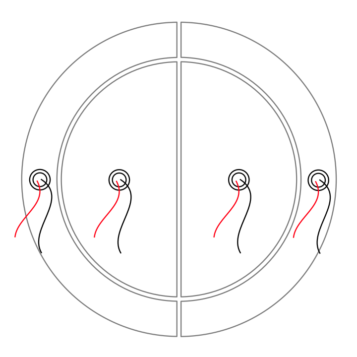
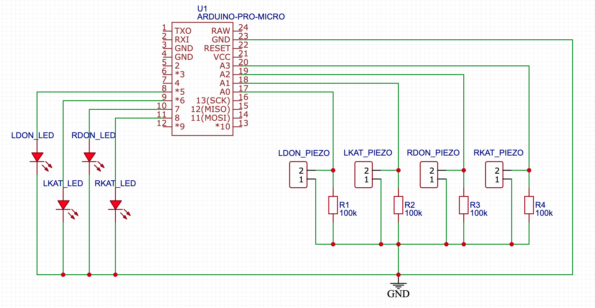
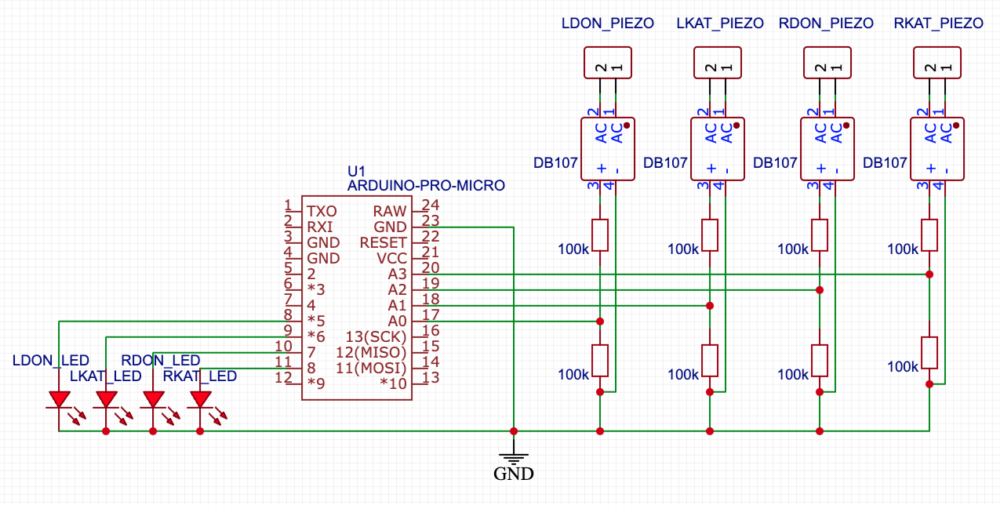
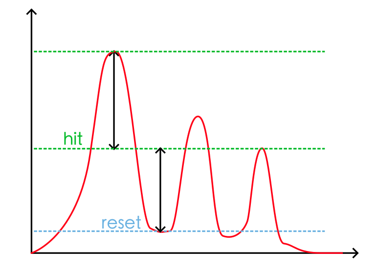
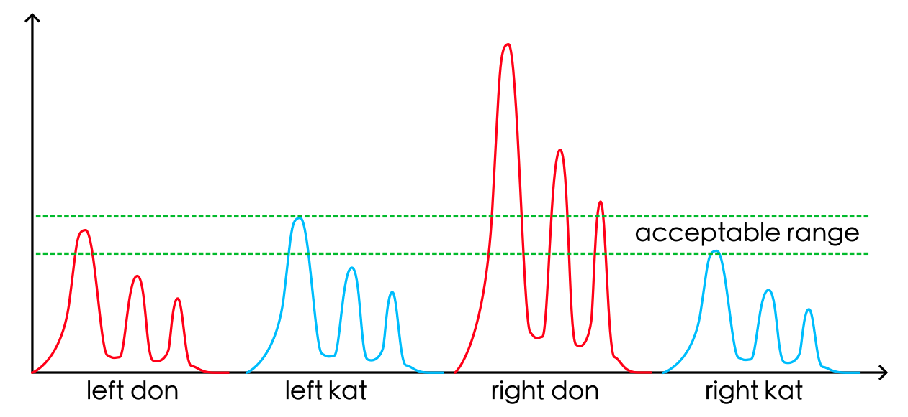
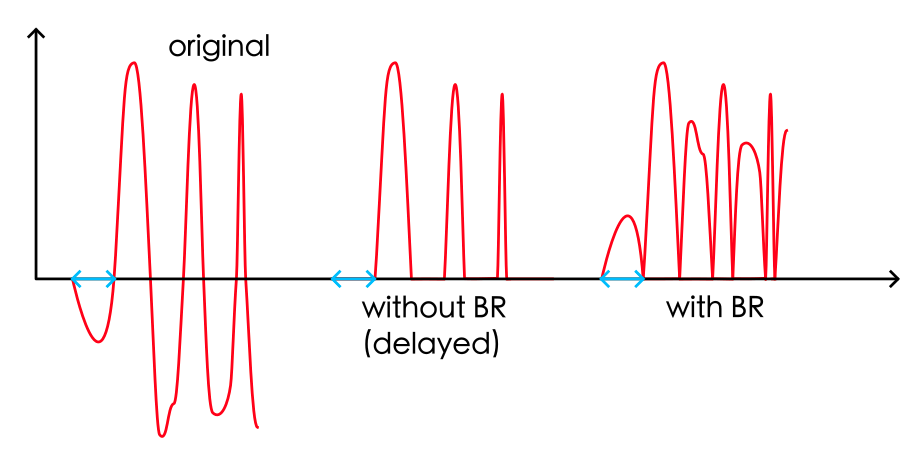
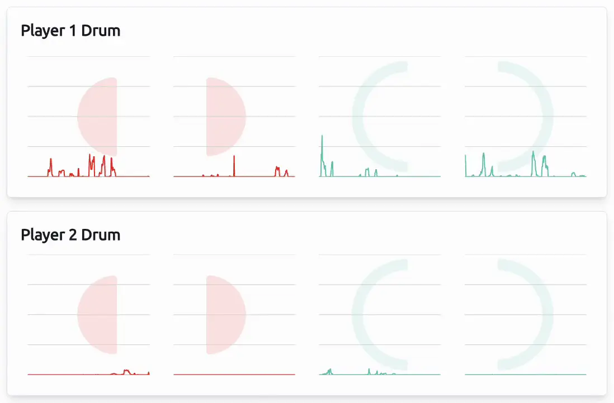

[Click here for English documentation](README.md)

[日本語のドキュメントはこちら](README_ja-JP.md)


# Taiko Drum Controller - Arduino (ATmega32U4/ESP32)

开源硬件程序，帮助你制作自己的太鼓达人PC控制器。它可以模拟作为键盘，或者作为模拟摇杆以启用击打力感应 - 就像您在街机上玩一样。现在还支持2个鼓，这样您就可以和朋友们一起在家享受游戏乐趣了！

## 关于本项目

本项目旨在帮助你在家制作自己的硬件太鼓。

**该程序仅供个人和非商业用途。**

## 你需要准备

1. 一个Arduino Micro/Leonardo (ATmega32U4) 板或一个Arduino Nano ESP (ESP32) 板。
   
   大多数ATmega32U4板都可以工作，但你需要验证它们是否支持键盘模拟；像Arduino Uno这样的ATmega328P板则不行。
   
   强烈推荐使用ESP32，因为它比ATmega32U4强大得多。该项目使用了ESP32-WROOM-32板。

2. 4个压电传感器。
   
3. 8个100kΩ电阻。
   
4. （可选）4个桥式整流器芯片，比如[DB107](https://www.diodes.com/assets/Datasheets/products_inactive_data/ds21211_R5.pdf)（详见附加说明部分）。

5. （可选）一些红色和蓝色的LED灯。
   
6. 必要的电子组件（面包板、LED灯、跳线等）。
   
7. 木板和切割工具（仅在你需要从头开始制作实体太鼓时使用）。如果你有市售太鼓或大力鼓Lv.5，可以直接使用。

## 制作控制器的步骤

1. 制作鼓，并将4个压电传感器牢固地粘贴在鼓上。参考图片以了解传感器的首选位置。
   
   

2. 按照以下方案将压电传感器和其他组件连接到控制器（压电传感器的极性无关紧要）;

   以下方案适用于Arduino Micro板。如果你使用不同的板，请参考其文档了解连接信息。
   
   

   如果你选择添加桥式整流器，请使用以下方案：
   
   

3. 将固件刷写到板上。
   
   你可能需要微调一些参数，如`SAMPLE_CACHE_LENGTH`、`HIT_THRES`、`RESET_THRES`和`sensitivity`。详见下一节。

4. 玩得开心！

## 调整参数

1. 击打和重置阈值
   
   设置`DEBUG 1`（这会禁用键盘输出并从串行端口发送信号值），刷写固件，在鼓的4个区域之一上滚动，然后从串行监视器的输出中查看图表。击打阈值应低于你在鼓上的最重击打，重置阈值应高于连续击打之间的低谷。重置值也应低于击打值。
   
   为剩下的3个区域重复此过程，并找到适合所有区域的最佳值。

   

2. 采样长度
   
   为了最大化运行速度，`cache.h`库已优化为支持2的幂次方窗口大小的`SAMPLE_CACHE_LENGTH`。这意味着2、8、16、32等。实际上，对于Arduino来说16是最佳值，但如果你有一个能以至少4000Hz或更高速度采样输入的强大微控制器，你可以将值改为32，以获得更平滑（换句话说，更少噪声）的曲线。

3. 灵敏度
   
   并非所有压电传感器都是相同的，由于安装错误，4个传感器捕获的信号可能有显著差异。灵敏度值是用来规范这些差异的乘数。在以下示例中，右边的don区域产生的值比其余3个区域高得多，所以你可以调整`sensitivity`为`{1.0, 1.0, 0.5, 1.0}`来解决这个问题。

   

   请注意，传感器的安装非常关键。你应该确保传感器牢固地贴在木头上，并且位置适当。

## 附加说明

1. 为什么使用桥式整流器

   如果不对压电传感器的电压进行偏置，它们的输出电压范围约为-5V到+5V。然而，模拟输入的ADC只接受正电压值（ESP32为0-3.3V，ATmega32U4为0-5V）。当它们接收到负电压时，通常会被简单地截断为0。
   
   对于普通的电子鼓来说，这通常没问题，因为我们只是失去了一半的输入能量，而这并不影响我们计算击打时间的方式。但是对于*太鼓*鼓来说，特别是像ATmega32U4这样的慢处理器，可能会造成问题。
   
   在太鼓鼓中，所有4个振动部件都连接在一起，这意味着如果你击打左边的don，处理器也会接收到左边的kat、右边的don和右边的kat的信号。如果左边的don压电传感器一开始就产生负电压，并被ADC截断，它将导致约3到4毫秒的轻微“延迟”，处理器可能会错误地将这次击打视为右边的don、左边的kat甚至右边的kat，取决于哪个发送了最高的正值。

   使用桥式整流器，所有负值都转换为正值。换句话说，就像`abs()`函数，确保我们不会丢失任何负电压。

   

# Taiko Controller - 模拟输入模式

使用ESP32-S2或ESP32-S3控制器，代替键盘仿真，鼓控制器可以作为游戏手柄工作，并将其轴值发送给游戏（游戏也必须支持模拟输入）。这样，游戏可以识别击打的不同力度级别。

如果您更喜欢使用Arduino Micro/Leonardo板，请参考[Arduino XInput库](https://github.com/dmadison/ArduinoXInput)来实现游戏手柄。

## 你需要什么

1. 制作你的鼓或使用Taiko Force Lv.5。详情请查看主分支。

2. 将`ESP32-S3-Analog/ESP32-S3-Analog.ino`刷写到你的控制器。

3. 一个能正常运行的***游戏***，并进行以下修改：

   - 备份并替换游戏文件夹中的`bnusio.dll`文件，使用这里`extra/`文件夹中的文件。

     这个文件是从[这个仓库](https://github.com/ShikyC/TaikoArcadeLoader/tree/Refactor)编译的，如果你愿意，你也可以自己编译。

     *这个修改过的库只适用于特定版本的游戏。如果它破坏了你的游戏，请克隆[原始仓库](https://github.com/BroGamer4256/TaikoArcadeLoader)，进行相应的修改，并编译它。*

   - 打开游戏文件夹中的`gamecontrollerdb.txt`文件，并在`#Windows`下添加一条条目：

     `030052a8694800006948000000000000,Taiko Controller,-leftx:-a0,+leftx:+a0,-lefty:-a1,+lefty:+a1,-rightx:-a2,+rightx:+a2,-righty:-a3,+righty:+a3,platform:Windows,`

     这将告诉游戏我们的ESP32控制器是一个名为“Taiko Controller”的游戏手柄，并将轴映射到标准SDL2库，以便游戏能够识别模拟输入。

   - 打开`config.toml`文件，并在末尾添加以下行：

     ```
     [controller]
     analog = true
     ```

     请注意，使用`analog = true`时，所有键盘鼓输入都将被禁用。对此表示抱歉，但它需要进一步重构才能同时工作。如果你想切换回键盘输入，请设置`analog = false`。

4. 开始游玩咚！

## 在线信号可视化工具

如果您发现通过串行端口的通信进行调试并找到最佳灵敏度值非常不便，您可以使用这个[太鼓信号可视化工具](https://shiky.me/taiko)。这是一个简单的工具，我创建它是为了显示太鼓控制器（仅限ESP32-Analog版本）的输出。

只需将板连接到计算机（使用USB端口，不使用串行端口），波形就会显示在图表中。因此，您无需开启调试模式或使用`Serial.print()`命令来获取调整灵敏度所需的值。

### 如何工作

控制器的模拟版本作为游戏手柄模拟，并将击打力量值作为左右摇杆的轴值发送到游戏中。通过内置的`Gamepad` API，直接读取值非常容易。为了防止工具读取其他游戏手柄，控制器必须命名为`Taiko Controller (Vendor: 4869 Product: 4869)`，因此请不要更改固件中的`pID`和`vID`值。


